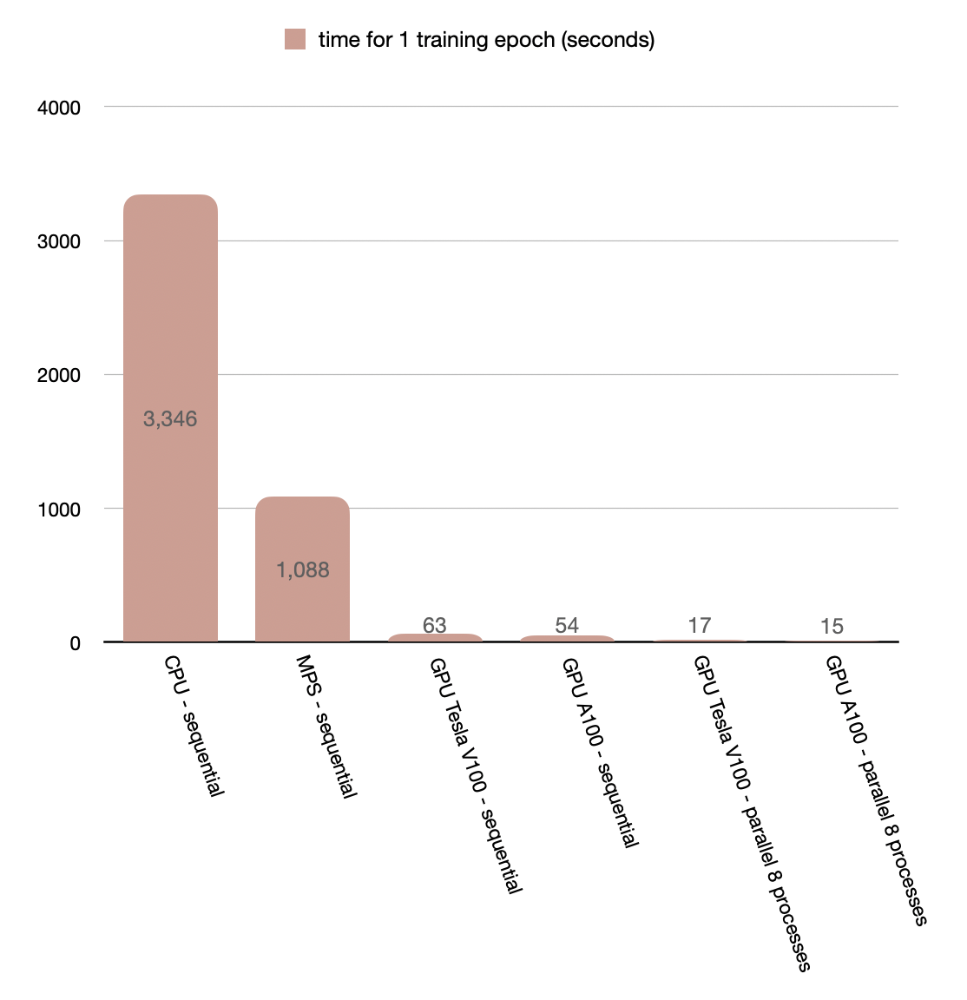

# rhea

This is yet another implementation of the Transformers from scratch. 

The original idea for the project was to just test how quick the new Apple GPU is (and the corresponding pytorch MPS device) compared to CUDA. Implementing a Transformer felt like an appropriate stuffing for this.

It follows the [original one](https://arxiv.org/pdf/1706.03762.pdf) for the model architecture and the exact kinds of layers involved,
although the signature of the attention functions is mostly inspired by this recent [DeepMind paper](https://arxiv.org/pdf/2207.09238.pdf) which gives pseudo-code algorithms for various components of the core Tranformer architecture.

There is also a distributed (data parallel) implementation, which significantly speeds up training. 

The CLI gives several options, including the possibility of training your own (huggingface) tokenizer from scratch on the dataset, how many processes to spawn for parallel training, etc.

The figure below shows the training time in seconds for 1 epoch on the training set on selected hardware and with different parallelism configurations:

## Contents

|     FILE/FOLDER       |   DESCRIPTION                                            |
|-----------------------|----------------------------------------------------------|
|   `assets`            |  Graph of training times for different types of hardware |
|   `requirements.txt`  |  List of python requirements                             |
|   `comp_utils.py`     |  Function to aid general computation, e.g. tokenizing    |
|   `ddp_utils.py`      |  Function to aid distributed computation                 |
|   `components.py`     |  Smaller (more fundamental) model compoents              |
|   `models.py`         |  "Fuller models" - more elaborate ensebles of components |
|   `procedures.py`     |  Train and Test functions                                |
|   `main.py`           |  Main execution script                                   |
|   `ddp_main.py`       |  Main execution script for distributed training          |

## To run

1. Run `python3 -m venv venv` to create a virtual environment.

2. (On Linux and MacOS) Activate the environment by running `source venv/bin/activate`.

3. Run `python3 -m pip install -r requirements.txt` to install the requirements.

4. Run either the `main.py` script ot the `ddp_main.py` for distributed training.